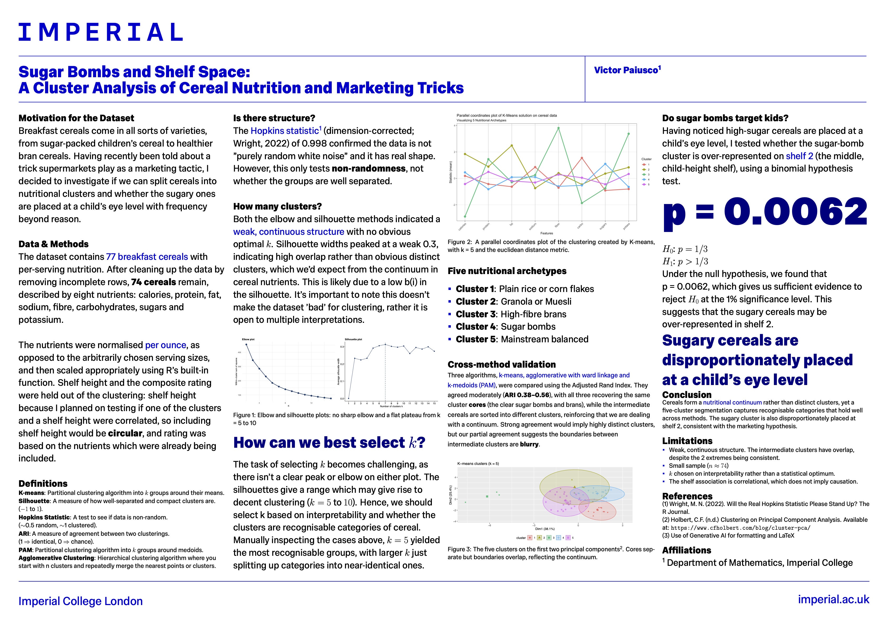

[Full-resolution PDF](Poster.pdf)

```{r setup, include=FALSE}
knitr::opts_chunk$set(echo = TRUE)
```

The next bit of code cleans up the data. It removes any rows with missing nutrient, weight, or shelf values. We exclude vitamins as in this dataset, they are described as discrete groups rather than a continuum. We eventually scale the nutrients so they are all relative to 1oz of cereal, as opposed to 1 serving size which can be arbitrarily chosen by the cereal company. We also exclude the shelf height before clustering, as I plan to conduct a test on the shelf height post-clustering, and including it would force a result and be circular. 

```{r}
cerealdf <- read.csv("cereal.csv", header = TRUE)
rownames(cerealdf) <- cerealdf$name
cerealdf$name <- NULL

#Filtering out the qualitative/missing data (Vitamins are discrete rather than continuous)
nutrient_cols <- c("calories", "protein", "fat", "sodium",
                   "fiber", "carbo", "sugars", "potass")
#Some columns use -1 as missing data, so we turn -1s into NA
cerealdf[nutrient_cols][cerealdf[nutrient_cols] == -1] <- NA
keepcols <- c(nutrient_cols, "weight", "shelf")
cereal_clean <- na.omit(cerealdf[keepcols])

#Divide all the nutrients through by that cereal's recommended serving weight
cereal_oz <- cereal_clean[nutrient_cols] / cereal_clean$weight

#Scale the data so it can be clustered appropriately
cereal_final <- scale(cereal_oz)
```
\newpage
```{r}
set.seed(79)
wcss <- c()
for (K in c(2:15)){
  kmeans_cereal <- kmeans(cereal_final,
                       centers = K,
                       iter.max = 100,
                       nstart = 100)
  wcss <- c(wcss, kmeans_cereal$tot.withinss)
}

plot(x = c(2:15), y = wcss,
     type = 'b', lwd = 2,
     pch = 16,
     xlab = 'K',
     ylab = 'Within-cluster sum of squares',
     main = 'Within-cluster sum of squares against number of clusters (K) on cereal dataset')
```

From this plot, we see there's no sharp 'elbow' and hence no clear optimal K value which we can deduce from just WCSS alone. I've chosen to only look up to k = 15, as any larger would have very little value in a dataset consisting of only 74 entries. I expected to see a somewhat weak structure to this dataset, as cereals come in all sorts of varieties and there will of course be some which lie in between the extremes, such as bran-heavy healthy cereals and child-orientated sugar bombs. Hence, this makes it very hard to split into discrete groups. 

```{r}
set.seed(79)
library(factoextra)

fviz_nbclust(cereal_final,
             FUNcluster = kmeans,
             method = "silhouette",
             k.max = 15,
             linecolor = 'blue') +
  ggtitle("Average silhouette width of K-Means solutions on cereal data set")
```

Again, weak sillhouette peak at K=7 with a mean sillhouette width of 0.3, which indicates there is a not a clear DISTINCT cluster structure. From this plot, we likely want to look in the range of k = 5 to 10
km5
```{r}
library(cluster)
library(factoextra)
library(patchwork)

set.seed(79)

cereal_gap <- clusGap(cereal_final,
                    FUNcluster = kmeans,
                    nstart = 100,
                    K.max = 15,
                    B = 100,
                    verbose = FALSE)

p1 <- fviz_gap_stat(gap_stat = cereal_gap,
                    linecolor = 'red',
                    maxSE = list(method = "globalmax")) +
  labs(title = "Gap statistic values for K-Means solutions on cereal data set",
       subtitle = "(Maximum Gap)")

# Select the number of clusters using the one SE rule
p2 <- fviz_gap_stat(gap_stat = cereal_gap,
                    linecolor = 'red',
                    maxSE = list(method = "Tibs2001SEmax")) +
  labs(title = "Gap statistic values for K-Means solutions on cereal data set",
       subtitle = "(One SE rule)")

p1 / p2
```

Since we got weak results from the past 3 intrinsic evaluation methods, I decided to look into a further method which gives me an idea of whether my dataset actually has some cluster structure, but is not split up into K obvious distinct groups, and is more of a continuum (as I expect, with very sugary, somewhat sugary, medium, somewhat healthy and healthy cereals)

Wright, "Will the Real Hopkins Statistic Please Stand Up?", The R Journal, 2022

```{r}
library(hopkins)

set.seed(79)  
#Replicate hopkins statistic 50 times and calculating a mean, as it is based on random number generation
niter <- 50
hopkins_results <- replicate(niter, {hopkins(cereal_final, m = 8, d=8)})
hopkins_mean <- mean(hopkins_results)
hopkins_mean
```

Very high Hopkins value indicates there is cluster structure and the data isn't "purely random white noise", and there is some form of shape/pattern. Combining this with our findings from the silhouette, we can conclude that the cluster structure is there, it is just not very separated and the boundaries between clusters are quite blurred (again, as expected). By nature of silhouette and its formula, it is a measure of how well-separated and distinct the clusters are. The d = 8 correction in Hopkins (Wright, 2022) calibrates the statistic to the dimension of the data, so this high value is not inflated due to high dimensions. This high value for Hopkins is only used to clear the low bar that the data is not "purely random white noise" and it has detected non-randomness, which is capable of coexisting with the low average silhouette.

Now, I wnat to look at k = 5,6,7 as these will be the most interpretable, as, by the nature of cereals and their nutrients, it is all a continuum and it would be tricky to pick out 10 distinct groups/varieties of cereal.

```{r, fig.width = 14, fig.height = 8}
#Generating a dendrogram to visualize our clustering and optimal value of K
dismat <- dist(cereal_final)
cerealhclust <- hclust(dismat, method = "ward.D2")
plot(cerealhclust, cex = 0.5, hang = -1, main = "Hierarchical Clustering of Cereal by Nutrients", xlab = "Cereal Name", ylab = "Distance", sub = "")
rect.hclust(cerealhclust, k = 5, border = "red")

plot(cerealhclust, cex = 0.5, hang = -1, main = "Hierarchical Clustering of Cereal by Nutrients", xlab = "Cereal Name", ylab = "Distance", sub = "")
rect.hclust(cerealhclust, k =6, border = "red")

plot(cerealhclust, cex = 0.5, hang = -1, main = "Hierarchical Clustering of Cereal by Nutrients", xlab = "Cereal Name", ylab = "Distance", sub = "")
rect.hclust(cerealhclust, k = 7, border = "red")
```

K = 5 seems the most sensible choice, with clear labels based on which cereals belong in which category. There is a clear 'sugar bomb' category, 

```{r}
set.seed(42)
for (k in c(5, 6, 7)) {
  cerealkm <- kmeans(cereal_final, centers = k, nstart = 100)
  cat("\n--- k =", k, "---\n")
  print(round(aggregate(cereal_oz, list(cluster = cerealkm$cluster), mean), 2))
  print(table(cerealkm$cluster))
}

km5 <- kmeans(cereal_final, centers = 5, nstart = 100)
split(names(km5$cluster), km5$cluster)
km5
center <- attr(cereal_final, "scaled:center")   # the means it subtracted
scl    <- attr(cereal_final, "scaled:scale")    # the SDs it divided by
 
centers_unscaled <- sweep(km5$centers, 2, scl, "*")          # × SD
centers_unscaled <- sweep(centers_unscaled, 2, center, "+")  # + mean
round(centers_unscaled, 2)
```

```{r}
library(aricode)

km_labels <- km5$cluster                 
hc_labels <- cutree(cerealhclust, k = 5)  

km_hc_ari <- ARI(km_labels, hc_labels)
km_hc_ari
cat("ARI between K-means and Hierarchical clustering:", km_hc_ari)
```

Fair ARI as was expected. From observation, we see both clustering algorithms have got the same/very similar extreme clusters in the sugar bombs and most healthy bran cereals, but again, as this dataset is more of a continuum, there are some discrepancies in between.

```{r}
library(aricode)
library(cluster)
set.seed(42)
pam5 <- pam(cereal_final, metric = "euclidean", k = 5)

km_pam_ari <- ARI(pam5$clustering, km_labels)
hc_pam_ari <- ARI(pam5$clustering, hc_labels)
cat("ARI between K-medoids and K-means:", km_pam_ari, "\n")
cat("ARI between K-medoids and Hierarchical clustering:", hc_pam_ari, "\n")
```

```{r}
library(factoextra)

p_pca <- fviz_cluster(km5, data = cereal_final, geom = "point",
                      ellipse.type = "norm", main = "K-means clusters (k = 5)") +
  theme(legend.position = "bottom")

ggsave("pca_clusters.pdf", p_pca, width = 9, height = 4, dpi = 300)
```

```{r}
library(factoextra)
fviz_cluster(km5, data = cereal_final,
             geom = "point",
             ellipse.type = "norm",
             main = "K-means clusters (k = 5)")
```
H0: The shelf height and what cluster a cereal belongs to are independent
H1: They are not independent
```{r}
cereal_group <- ifelse(km5$cluster == 4, "Sugar Bomb", "Other")
# 1. Count how many Sugar Bombs there are in total
total_sugar_bombs <- sum(cereal_group == "Sugar Bomb")

# 2. Count how many of those are specifically on Shelf 2
sugar_on_shelf_2 <- sum(cereal_group == "Sugar Bomb" & cereal_clean$shelf == 2)

# 3. Run the Binomial Test
# Testing if the true probability is greater than 1/3 (0.333)
binom_test <- binom.test(x = sugar_on_shelf_2, 
                         n = total_sugar_bombs, 
                         p = 1/3, 
                         alternative = "greater")
print(binom_test)
```

```{r}
library(ggplot2)

# Corrected parallel coordinates function
parallel_coords_plot <- function(data, labels, stat_fun = mean, 
                                 rotate_labels = 45, 
                                 line_size = 1.2, 
                                 point_size = 3) {
  
  data <- as.data.frame(data)
  clusters <- unique(labels)
  n_clusters <- length(clusters)
  n_features <- ncol(data)
  feature_names <- colnames(data)
  
  # Matrix: Rows = Clusters, Cols = Features
  stat_matrix <- matrix(NA, nrow = n_clusters, ncol = n_features)
  
  for(i in seq_along(clusters)) {
    cluster_data <- data[labels == clusters[i], , drop = FALSE]
    for(j in 1:n_features) {
      stat_matrix[i, j] <- stat_fun(cluster_data[, j])
    }
  }
  
  # THE FIX: Removed t() from stat_matrix so the vector aligns with 'each' and 'times'
  plot_data <- data.frame(
    Feature = rep(feature_names, each = n_clusters),
    Value = as.vector(stat_matrix), 
    Cluster = rep(as.character(clusters), times = n_features),
    Feature_num = rep(1:n_features, each = n_clusters)
  )
  
  p <- ggplot(plot_data, aes(x = Feature_num, y = Value, 
                             group = Cluster, color = Cluster)) +
    geom_line(linewidth = line_size) +
    geom_point(size = point_size) +
    scale_x_continuous(breaks = 1:n_features, labels = feature_names) +
    theme_bw() +
    labs(x = "Features", y = paste0("Statistic (", deparse(substitute(stat_fun)), ")"), 
         color = "Cluster") +
    theme(
      axis.text.x = element_text(angle = rotate_labels, 
                                 hjust = if(rotate_labels > 0) 1 else 0.5, 
                                 size = 10),
      legend.position = "right",
      panel.grid.major.x = element_line(color = "grey80"),
      panel.grid.minor = element_blank()
    )
  
  return(p)
}

# Generate and save the corrected plot
my_parallel_plot <- parallel_coords_plot(data = cereal_final, 
                     labels = km5$cluster, 
                     stat_fun = mean, 
                     rotate_labels = 45) +
  labs(title = 'Parallel coordinates plot of K-Means solution on cereal data',
       subtitle = 'Visualizing 5 Nutritional Archetypes')

print(my_parallel_plot)
ggsave("cereal_parallel_plot_corrected.png", plot = my_parallel_plot, width = 10, height = 6, dpi = 300)
```


