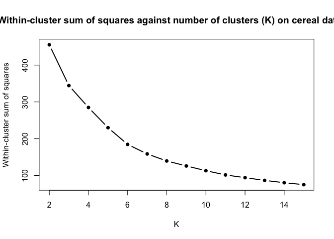
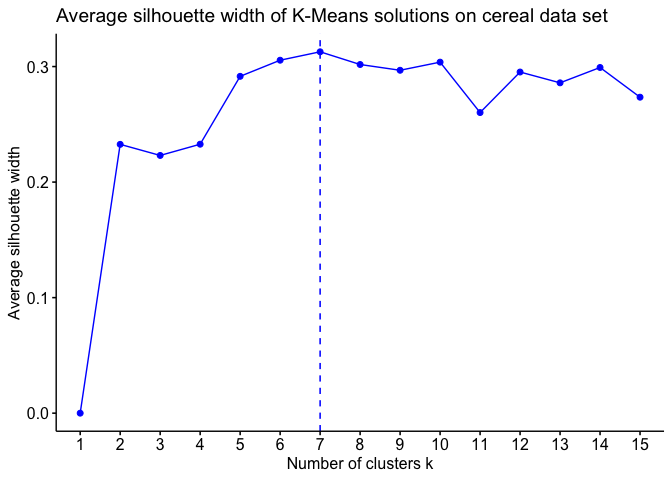
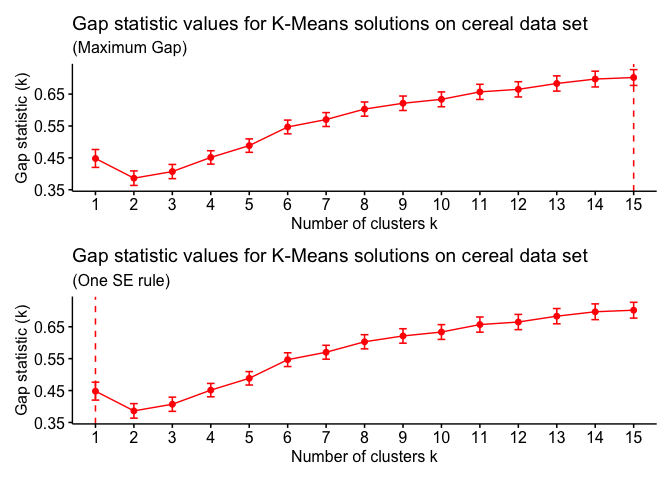
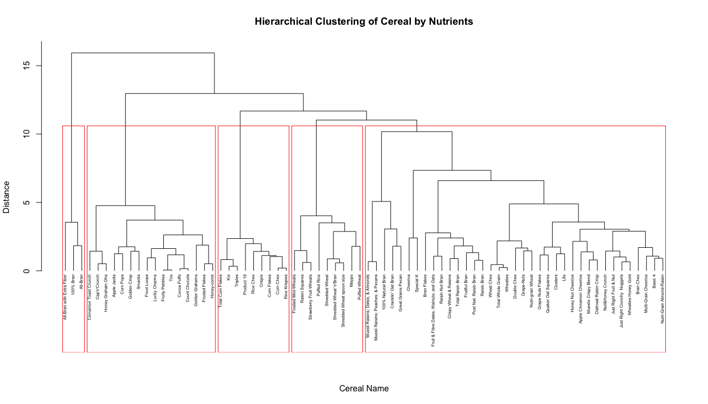
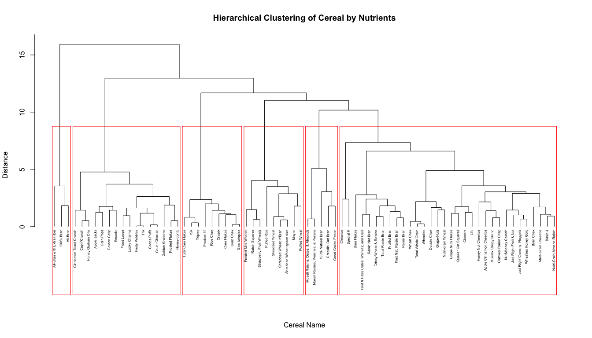
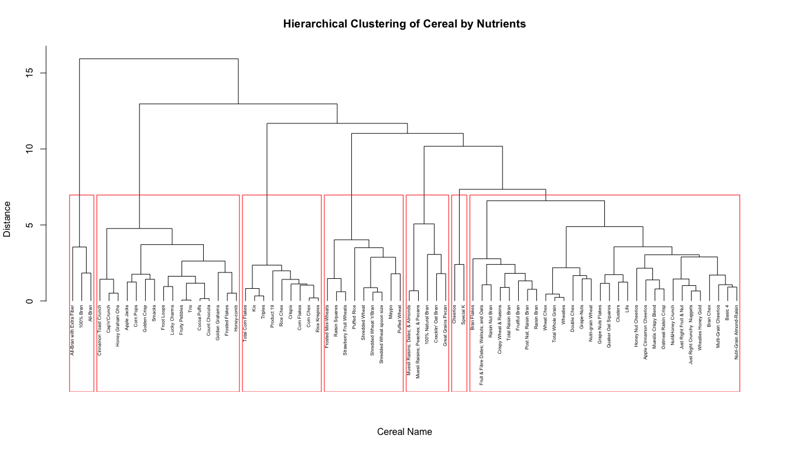
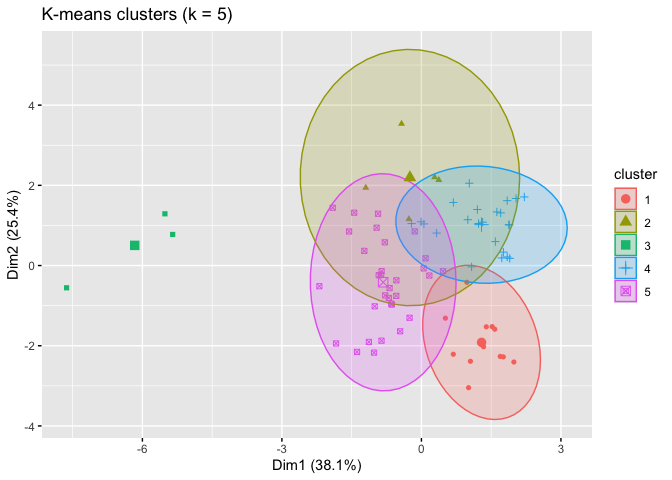
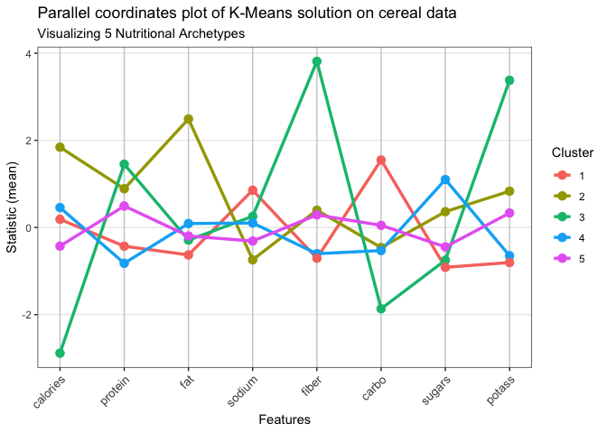

Cereal Clustering
================
Victor Paiusco
2026-06-06


[Full-resolution PDF](Poster.pdf)

The next bit of code cleans up the data. It removes any rows with
missing nutrient, weight, or shelf values. We exclude vitamins as in
this dataset, they are described as discrete groups rather than a
continuum. We eventually scale the nutrients so they are all relative to
1oz of cereal, as opposed to 1 serving size which can be arbitrarily
chosen by the cereal company. We also exclude the shelf height before
clustering, as I plan to conduct a test on the shelf height
post-clustering, and including it would force a result and be circular.

``` r
cerealdf <- read.csv("cereal.csv", header = TRUE)
rownames(cerealdf) <- cerealdf$name
cerealdf$name <- NULL

#Filtering out the qualitative/missing data (Vitamins are discrete rather than continuous)
nutrient_cols <- c("calories", "protein", "fat", "sodium",
                   "fiber", "carbo", "sugars", "potass")
#Some columns use -1 as missing data, so we turn -1s into NA
cerealdf[nutrient_cols][cerealdf[nutrient_cols] == -1] <- NA
keepcols <- c(nutrient_cols, "weight", "shelf")
cereal_clean <- na.omit(cerealdf[keepcols])

#Divide all the nutrients through by that cereal's recommended serving weight
cereal_oz <- cereal_clean[nutrient_cols] / cereal_clean$weight

#Scale the data so it can be clustered appropriately
cereal_final <- scale(cereal_oz)
```

``` r
set.seed(79)
wcss <- c()
for (K in c(2:15)){
  kmeans_cereal <- kmeans(cereal_final,
                       centers = K,
                       iter.max = 100,
                       nstart = 100)
  wcss <- c(wcss, kmeans_cereal$tot.withinss)
}

plot(x = c(2:15), y = wcss,
     type = 'b', lwd = 2,
     pch = 16,
     xlab = 'K',
     ylab = 'Within-cluster sum of squares',
     main = 'Within-cluster sum of squares against number of clusters (K) on cereal dataset')
```

<!-- -->

From this plot, we see there’s no sharp ‘elbow’ and hence no clear
optimal K value which we can deduce from just WCSS alone. I’ve chosen to
only look up to k = 15, as any larger would have very little value in a
dataset consisting of only 74 entries. I expected to see a somewhat weak
structure to this dataset, as cereals come in all sorts of varieties and
there will of course be some which lie in between the extremes, such as
bran-heavy healthy cereals and child-orientated sugar bombs. Hence, this
makes it very hard to split into discrete groups.

``` r
set.seed(79)
library(factoextra)
```

    ## Loading required package: ggplot2

    ## Welcome to factoextra!

    ## Want to learn more? See two factoextra-related books at https://www.datanovia.com/en/product/practical-guide-to-principal-component-methods-in-r/

``` r
fviz_nbclust(cereal_final,
             FUNcluster = kmeans,
             method = "silhouette",
             k.max = 15,
             linecolor = 'blue') +
  ggtitle("Average silhouette width of K-Means solutions on cereal data set")
```

<!-- -->

Again, weak sillhouette peak at K=7 with a mean sillhouette width of
0.3, which indicates there is a not a clear DISTINCT cluster structure.
From this plot, we likely want to look in the range of k = 5 to 10 km5

``` r
library(cluster)
library(factoextra)
library(patchwork)

set.seed(79)

cereal_gap <- clusGap(cereal_final,
                    FUNcluster = kmeans,
                    nstart = 100,
                    K.max = 15,
                    B = 100,
                    verbose = FALSE)

p1 <- fviz_gap_stat(gap_stat = cereal_gap,
                    linecolor = 'red',
                    maxSE = list(method = "globalmax")) +
  labs(title = "Gap statistic values for K-Means solutions on cereal data set",
       subtitle = "(Maximum Gap)")

# Select the number of clusters using the one SE rule
p2 <- fviz_gap_stat(gap_stat = cereal_gap,
                    linecolor = 'red',
                    maxSE = list(method = "Tibs2001SEmax")) +
  labs(title = "Gap statistic values for K-Means solutions on cereal data set",
       subtitle = "(One SE rule)")

p1 / p2
```

<!-- -->

Since we got weak results from the past 3 intrinsic evaluation methods,
I decided to look into a further method which gives me an idea of
whether my dataset actually has some cluster structure, but is not split
up into K obvious distinct groups, and is more of a continuum (as I
expect, with very sugary, somewhat sugary, medium, somewhat healthy and
healthy cereals)

Wright, “Will the Real Hopkins Statistic Please Stand Up?”, The R
Journal, 2022

``` r
library(hopkins)

set.seed(79)  
#Replicate hopkins statistic 50 times and calculating a mean, as it is based on random number generation
niter <- 50
hopkins_results <- replicate(niter, {hopkins(cereal_final, m = 8, d=8)})
hopkins_mean <- mean(hopkins_results)
hopkins_mean
```

    ## [1] 0.9981694

Very high Hopkins value indicates there is cluster structure and the
data isn’t “purely random white noise”, and there is some form of
shape/pattern. Combining this with our findings from the silhouette, we
can conclude that the cluster structure is there, it is just not very
separated and the boundaries between clusters are quite blurred (again,
as expected). By nature of silhouette and its formula, it is a measure
of how well-separated and distinct the clusters are. The d = 8
correction in Hopkins (Wright, 2022) calibrates the statistic to the
dimension of the data, so this high value is not inflated due to high
dimensions. This high value for Hopkins is only used to clear the low
bar that the data is not “purely random white noise” and it has detected
non-randomness, which is capable of coexisting with the low average
silhouette.

Now, I wnat to look at k = 5,6,7 as these will be the most
interpretable, as, by the nature of cereals and their nutrients, it is
all a continuum and it would be tricky to pick out 10 distinct
groups/varieties of cereal.

``` r
#Generating a dendrogram to visualize our clustering and optimal value of K
dismat <- dist(cereal_final)
cerealhclust <- hclust(dismat, method = "ward.D2")
plot(cerealhclust, cex = 0.5, hang = -1, main = "Hierarchical Clustering of Cereal by Nutrients", xlab = "Cereal Name", ylab = "Distance", sub = "")
rect.hclust(cerealhclust, k = 5, border = "red")
```

<!-- -->

``` r
plot(cerealhclust, cex = 0.5, hang = -1, main = "Hierarchical Clustering of Cereal by Nutrients", xlab = "Cereal Name", ylab = "Distance", sub = "")
rect.hclust(cerealhclust, k =6, border = "red")
```

<!-- -->

``` r
plot(cerealhclust, cex = 0.5, hang = -1, main = "Hierarchical Clustering of Cereal by Nutrients", xlab = "Cereal Name", ylab = "Distance", sub = "")
rect.hclust(cerealhclust, k = 7, border = "red")
```

<!-- -->

K = 5 seems the most sensible choice, with clear labels based on which
cereals belong in which category. There is a clear ‘sugar bomb’
category,

``` r
set.seed(42)
for (k in c(5, 6, 7)) {
  cerealkm <- kmeans(cereal_final, centers = k, nstart = 100)
  cat("\n--- k =", k, "---\n")
  print(round(aggregate(cereal_oz, list(cluster = cerealkm$cluster), mean), 2))
  print(table(cerealkm$cluster))
}
```

    ## 
    ## --- k = 5 ---
    ##   cluster calories protein  fat sodium fiber carbo sugars potass
    ## 1       1    97.97    2.98 0.76 130.24  2.75 14.76   4.91 114.92
    ## 2       2   106.67    2.00 0.33 225.83  0.42 21.08   3.00  42.08
    ## 3       3   110.46    1.58 1.04 164.17  0.66 12.31  11.20  52.07
    ## 4       4   130.00    3.40 3.40  95.00  3.00 12.60   8.20 147.00
    ## 5       5    63.33    4.00 0.67 176.67 11.00  6.67   3.67 310.00
    ## 
    ##  1  2  3  4  5 
    ## 31 12 23  5  3 
    ## 
    ## --- k = 6 ---
    ##   cluster calories protein  fat sodium fiber carbo sugars potass
    ## 1       1   105.88    2.71 0.47 235.29  1.18 19.35   3.00  61.18
    ## 2       2    63.33    4.00 0.67 176.67 11.00  6.67   3.67 310.00
    ## 3       3   130.00    3.40 3.40  95.00  3.00 12.60   8.20 147.00
    ## 4       4    99.11    2.59 1.12 159.93  2.68 12.46   7.27 120.99
    ## 5       5    95.15    2.82 0.11   1.67  2.29 18.25   2.33  99.94
    ## 6       6   111.58    1.42 1.00 165.79  0.45 12.55  11.63  41.32
    ## 
    ##  1  2  3  4  5  6 
    ## 17  3  5 21  9 19 
    ## 
    ## --- k = 7 ---
    ##   cluster calories protein  fat sodium fiber carbo sugars potass
    ## 1       1    94.64    2.84 0.10  18.50  2.36 18.23   2.30  98.95
    ## 2       2   107.27    2.00 0.36 246.36  0.45 20.64   3.27  43.18
    ## 3       3    99.64    2.64 1.06 164.94  2.72 13.03   6.74 118.99
    ## 4       4   130.00    3.40 3.40  95.00  3.00 12.60   8.20 147.00
    ## 5       5   111.58    1.42 1.00 165.79  0.45 12.55  11.63  41.32
    ## 6       6    63.33    4.00 0.67 176.67 11.00  6.67   3.67 310.00
    ## 7       7   110.00    6.00 1.00 260.00  1.50 16.50   2.00  80.00
    ## 
    ##  1  2  3  4  5  6  7 
    ## 10 11 24  5 19  3  2

``` r
km5 <- kmeans(cereal_final, centers = 5, nstart = 100)
split(names(km5$cluster), km5$cluster)
```

    ## $`1`
    ##  [1] "Corn Chex"                   "Corn Flakes"                
    ##  [3] "Crispix"                     "Double Chex"                
    ##  [5] "Just Right Crunchy  Nuggets" "Kix"                        
    ##  [7] "Product 19"                  "Puffed Rice"                
    ##  [9] "Rice Chex"                   "Rice Krispies"              
    ## [11] "Total Corn Flakes"           "Triples"                    
    ## 
    ## $`2`
    ## [1] "100% Natural Bran"                 "Cracklin' Oat Bran"               
    ## [3] "Great Grains Pecan"                "Muesli Raisins; Dates; & Almonds" 
    ## [5] "Muesli Raisins; Peaches; & Pecans"
    ## 
    ## $`3`
    ## [1] "100% Bran"                 "All-Bran"                 
    ## [3] "All-Bran with Extra Fiber"
    ## 
    ## $`4`
    ##  [1] "Apple Cinnamon Cheerios" "Apple Jacks"            
    ##  [3] "Cap'n'Crunch"            "Cinnamon Toast Crunch"  
    ##  [5] "Cocoa Puffs"             "Corn Pops"              
    ##  [7] "Count Chocula"           "Crispy Wheat & Raisins" 
    ##  [9] "Froot Loops"             "Frosted Flakes"         
    ## [11] "Fruity Pebbles"          "Golden Crisp"           
    ## [13] "Golden Grahams"          "Honey Graham Ohs"       
    ## [15] "Honey Nut Cheerios"      "Honey-comb"             
    ## [17] "Lucky Charms"            "Mueslix Crispy Blend"   
    ## [19] "Nut&Honey Crunch"        "Oatmeal Raisin Crisp"   
    ## [21] "Smacks"                  "Trix"                   
    ## [23] "Wheaties Honey Gold"    
    ## 
    ## $`5`
    ##  [1] "Basic 4"                               
    ##  [2] "Bran Chex"                             
    ##  [3] "Bran Flakes"                           
    ##  [4] "Cheerios"                              
    ##  [5] "Clusters"                              
    ##  [6] "Frosted Mini-Wheats"                   
    ##  [7] "Fruit & Fibre Dates; Walnuts; and Oats"
    ##  [8] "Fruitful Bran"                         
    ##  [9] "Grape Nuts Flakes"                     
    ## [10] "Grape-Nuts"                            
    ## [11] "Just Right Fruit & Nut"                
    ## [12] "Life"                                  
    ## [13] "Maypo"                                 
    ## [14] "Multi-Grain Cheerios"                  
    ## [15] "Nutri-Grain Almond-Raisin"             
    ## [16] "Nutri-grain Wheat"                     
    ## [17] "Post Nat. Raisin Bran"                 
    ## [18] "Puffed Wheat"                          
    ## [19] "Quaker Oat Squares"                    
    ## [20] "Raisin Bran"                           
    ## [21] "Raisin Nut Bran"                       
    ## [22] "Raisin Squares"                        
    ## [23] "Shredded Wheat"                        
    ## [24] "Shredded Wheat 'n'Bran"                
    ## [25] "Shredded Wheat spoon size"             
    ## [26] "Special K"                             
    ## [27] "Strawberry Fruit Wheats"               
    ## [28] "Total Raisin Bran"                     
    ## [29] "Total Whole Grain"                     
    ## [30] "Wheat Chex"                            
    ## [31] "Wheaties"

``` r
km5
```

    ## K-means clustering with 5 clusters of sizes 12, 5, 3, 23, 31
    ## 
    ## Cluster means:
    ##     calories    protein        fat     sodium      fiber       carbo     sugars
    ## 1  0.1874284 -0.4296630 -0.6301717  0.8556900 -0.7069768  1.54846432 -0.9152380
    ## 2  1.8422026  0.8874665  2.4913078 -0.7426477  0.3965104 -0.46151097  0.3618412
    ## 3 -2.8857239  1.4519505 -0.2908805  0.2550408  3.8137611 -1.86730901 -0.7515099
    ## 4  0.4567146 -0.8223475  0.0897158  0.1024219 -0.6026640 -0.53018698  1.0993296
    ## 5 -0.4292716  0.4927988 -0.1963000 -0.3121247  0.2877793  0.04910357 -0.4469806
    ##       potass
    ## 1 -0.8051959
    ## 2  0.8329716
    ## 3  3.3780516
    ## 4 -0.6492258
    ## 5  0.3321139
    ## 
    ## Clustering vector:
    ##                              100% Bran                      100% Natural Bran 
    ##                                      3                                      2 
    ##                               All-Bran              All-Bran with Extra Fiber 
    ##                                      3                                      3 
    ##                Apple Cinnamon Cheerios                            Apple Jacks 
    ##                                      4                                      4 
    ##                                Basic 4                              Bran Chex 
    ##                                      5                                      5 
    ##                            Bran Flakes                           Cap'n'Crunch 
    ##                                      5                                      4 
    ##                               Cheerios                  Cinnamon Toast Crunch 
    ##                                      5                                      4 
    ##                               Clusters                            Cocoa Puffs 
    ##                                      5                                      4 
    ##                              Corn Chex                            Corn Flakes 
    ##                                      1                                      1 
    ##                              Corn Pops                          Count Chocula 
    ##                                      4                                      4 
    ##                     Cracklin' Oat Bran                                Crispix 
    ##                                      2                                      1 
    ##                 Crispy Wheat & Raisins                            Double Chex 
    ##                                      4                                      1 
    ##                            Froot Loops                         Frosted Flakes 
    ##                                      4                                      4 
    ##                    Frosted Mini-Wheats Fruit & Fibre Dates; Walnuts; and Oats 
    ##                                      5                                      5 
    ##                          Fruitful Bran                         Fruity Pebbles 
    ##                                      5                                      4 
    ##                           Golden Crisp                         Golden Grahams 
    ##                                      4                                      4 
    ##                      Grape Nuts Flakes                             Grape-Nuts 
    ##                                      5                                      5 
    ##                     Great Grains Pecan                       Honey Graham Ohs 
    ##                                      2                                      4 
    ##                     Honey Nut Cheerios                             Honey-comb 
    ##                                      4                                      4 
    ##            Just Right Crunchy  Nuggets                 Just Right Fruit & Nut 
    ##                                      1                                      5 
    ##                                    Kix                                   Life 
    ##                                      1                                      5 
    ##                           Lucky Charms                                  Maypo 
    ##                                      4                                      5 
    ##       Muesli Raisins; Dates; & Almonds      Muesli Raisins; Peaches; & Pecans 
    ##                                      2                                      2 
    ##                   Mueslix Crispy Blend                   Multi-Grain Cheerios 
    ##                                      4                                      5 
    ##                       Nut&Honey Crunch              Nutri-Grain Almond-Raisin 
    ##                                      4                                      5 
    ##                      Nutri-grain Wheat                   Oatmeal Raisin Crisp 
    ##                                      5                                      4 
    ##                  Post Nat. Raisin Bran                             Product 19 
    ##                                      5                                      1 
    ##                            Puffed Rice                           Puffed Wheat 
    ##                                      1                                      5 
    ##                     Quaker Oat Squares                            Raisin Bran 
    ##                                      5                                      5 
    ##                        Raisin Nut Bran                         Raisin Squares 
    ##                                      5                                      5 
    ##                              Rice Chex                          Rice Krispies 
    ##                                      1                                      1 
    ##                         Shredded Wheat                 Shredded Wheat 'n'Bran 
    ##                                      5                                      5 
    ##              Shredded Wheat spoon size                                 Smacks 
    ##                                      5                                      4 
    ##                              Special K                Strawberry Fruit Wheats 
    ##                                      5                                      5 
    ##                      Total Corn Flakes                      Total Raisin Bran 
    ##                                      1                                      5 
    ##                      Total Whole Grain                                Triples 
    ##                                      5                                      1 
    ##                                   Trix                             Wheat Chex 
    ##                                      4                                      5 
    ##                               Wheaties                    Wheaties Honey Gold 
    ##                                      5                                      4 
    ## 
    ## Within cluster sum of squares by cluster:
    ## [1]  23.428748  19.398302   7.998292  49.402499 129.732455
    ##  (between_SS / total_SS =  60.6 %)
    ## 
    ## Available components:
    ## 
    ## [1] "cluster"      "centers"      "totss"        "withinss"     "tot.withinss"
    ## [6] "betweenss"    "size"         "iter"         "ifault"

``` r
center <- attr(cereal_final, "scaled:center")   # the means it subtracted
scl    <- attr(cereal_final, "scaled:scale")    # the SDs it divided by
 
centers_unscaled <- sweep(km5$centers, 2, scl, "*")          # × SD
centers_unscaled <- sweep(centers_unscaled, 2, center, "+")  # + mean
round(centers_unscaled, 2)
```

    ##   calories protein  fat sodium fiber carbo sugars potass
    ## 1   106.67    2.00 0.33 225.83  0.42 21.08   3.00  42.08
    ## 2   130.00    3.40 3.40  95.00  3.00 12.60   8.20 147.00
    ## 3    63.33    4.00 0.67 176.67 11.00  6.67   3.67 310.00
    ## 4   110.46    1.58 1.04 164.17  0.66 12.31  11.20  52.07
    ## 5    97.97    2.98 0.76 130.24  2.75 14.76   4.91 114.92

``` r
library(aricode)

km_labels <- km5$cluster                 
hc_labels <- cutree(cerealhclust, k = 5)  

km_hc_ari <- ARI(km_labels, hc_labels)
km_hc_ari
```

    ## [1] 0.3790653

``` r
cat("ARI between K-means and Hierarchical clustering:", km_hc_ari)
```

    ## ARI between K-means and Hierarchical clustering: 0.3790653

Fair ARI as was expected. From observation, we see both clustering
algorithms have got the same/very similar extreme clusters in the sugar
bombs and most healthy bran cereals, but again, as this dataset is more
of a continuum, there are some discrepancies in between.

``` r
library(aricode)
library(cluster)
set.seed(42)
pam5 <- pam(cereal_final, metric = "euclidean", k = 5)

km_pam_ari <- ARI(pam5$clustering, km_labels)
hc_pam_ari <- ARI(pam5$clustering, hc_labels)
cat("ARI between K-medoids and K-means:", km_pam_ari, "\n")
```

    ## ARI between K-medoids and K-means: 0.3998642

``` r
cat("ARI between K-medoids and Hierarchical clustering:", hc_pam_ari, "\n")
```

    ## ARI between K-medoids and Hierarchical clustering: 0.5572513

``` r
library(factoextra)

p_pca <- fviz_cluster(km5, data = cereal_final, geom = "point",
                      ellipse.type = "norm", main = "K-means clusters (k = 5)") +
  theme(legend.position = "bottom")

ggsave("pca_clusters.pdf", p_pca, width = 9, height = 4, dpi = 300)
```

    ## Too few points to calculate an ellipse

``` r
library(factoextra)
fviz_cluster(km5, data = cereal_final,
             geom = "point",
             ellipse.type = "norm",
             main = "K-means clusters (k = 5)")
```

    ## Too few points to calculate an ellipse

<!-- -->
H0: The shelf height and what cluster a cereal belongs to are
independent H1: They are not independent

``` r
cereal_group <- ifelse(km5$cluster == 4, "Sugar Bomb", "Other")
# 1. Count how many Sugar Bombs there are in total
total_sugar_bombs <- sum(cereal_group == "Sugar Bomb")

# 2. Count how many of those are specifically on Shelf 2
sugar_on_shelf_2 <- sum(cereal_group == "Sugar Bomb" & cereal_clean$shelf == 2)

# 3. Run the Binomial Test
# Testing if the true probability is greater than 1/3 (0.333)
binom_test <- binom.test(x = sugar_on_shelf_2, 
                         n = total_sugar_bombs, 
                         p = 1/3, 
                         alternative = "greater")
print(binom_test)
```

    ## 
    ##  Exact binomial test
    ## 
    ## data:  sugar_on_shelf_2 and total_sugar_bombs
    ## number of successes = 14, number of trials = 23, p-value = 0.006193
    ## alternative hypothesis: true probability of success is greater than 0.3333333
    ## 95 percent confidence interval:
    ##  0.4168452 1.0000000
    ## sample estimates:
    ## probability of success 
    ##              0.6086957

``` r
library(ggplot2)

# Corrected parallel coordinates function
parallel_coords_plot <- function(data, labels, stat_fun = mean, 
                                 rotate_labels = 45, 
                                 line_size = 1.2, 
                                 point_size = 3) {
  
  data <- as.data.frame(data)
  clusters <- unique(labels)
  n_clusters <- length(clusters)
  n_features <- ncol(data)
  feature_names <- colnames(data)
  
  # Matrix: Rows = Clusters, Cols = Features
  stat_matrix <- matrix(NA, nrow = n_clusters, ncol = n_features)
  
  for(i in seq_along(clusters)) {
    cluster_data <- data[labels == clusters[i], , drop = FALSE]
    for(j in 1:n_features) {
      stat_matrix[i, j] <- stat_fun(cluster_data[, j])
    }
  }
  
  # THE FIX: Removed t() from stat_matrix so the vector aligns with 'each' and 'times'
  plot_data <- data.frame(
    Feature = rep(feature_names, each = n_clusters),
    Value = as.vector(stat_matrix), 
    Cluster = rep(as.character(clusters), times = n_features),
    Feature_num = rep(1:n_features, each = n_clusters)
  )
  
  p <- ggplot(plot_data, aes(x = Feature_num, y = Value, 
                             group = Cluster, color = Cluster)) +
    geom_line(linewidth = line_size) +
    geom_point(size = point_size) +
    scale_x_continuous(breaks = 1:n_features, labels = feature_names) +
    theme_bw() +
    labs(x = "Features", y = paste0("Statistic (", deparse(substitute(stat_fun)), ")"), 
         color = "Cluster") +
    theme(
      axis.text.x = element_text(angle = rotate_labels, 
                                 hjust = if(rotate_labels > 0) 1 else 0.5, 
                                 size = 10),
      legend.position = "right",
      panel.grid.major.x = element_line(color = "grey80"),
      panel.grid.minor = element_blank()
    )
  
  return(p)
}

# Generate and save the corrected plot
my_parallel_plot <- parallel_coords_plot(data = cereal_final, 
                     labels = km5$cluster, 
                     stat_fun = mean, 
                     rotate_labels = 45) +
  labs(title = 'Parallel coordinates plot of K-Means solution on cereal data',
       subtitle = 'Visualizing 5 Nutritional Archetypes')

print(my_parallel_plot)
```

<!-- -->

``` r
ggsave("cereal_parallel_plot_corrected.png", plot = my_parallel_plot, width = 10, height = 6, dpi = 300)
```
